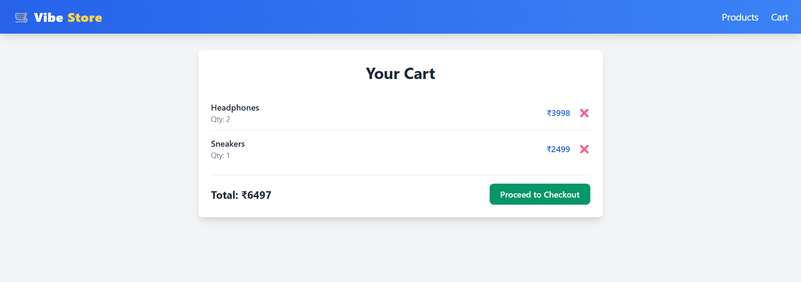
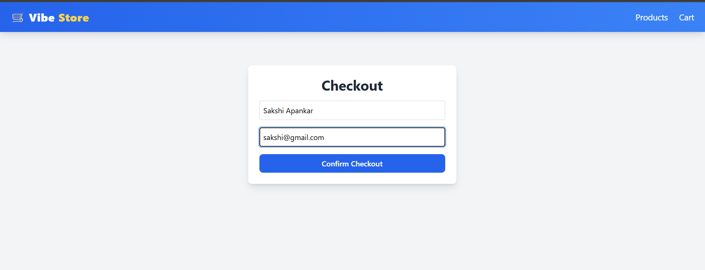
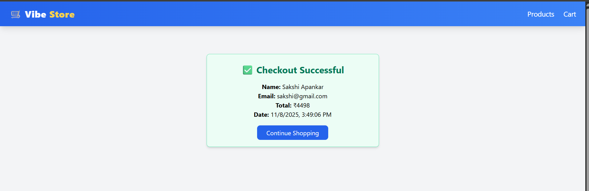

# mock-ecom-cart
🛍️ Mock E-Com Cart

A simple full-stack e-commerce cart app built with React (Vite) for the frontend and Node.js + Express + SQLite for the backend.

⚙️ Tech Stack

Frontend: React + Vite + Tailwind CSS

Backend: Node.js + Express

Database: SQLite

🚀 Features

Display product list with images and prices

Add or remove items from cart

Checkout with name and email (mock flow)

Responsive and clean UI

# 🖼️ Screenshots

**🛒 Product Page**  
Shows the list of available products with images, prices, and “Add to Cart” buttons.  

---

**🧺 Cart Page**  
Displays all added items with quantity and total price before checkout.  

---

**💳 Checkout Page**  
User fills in name and email to place the order.  

---

**✅ Checkout Successful (Receipt Page)**  
Displays order confirmation with name, email, total, and date.  

🔧 Setup
# Clone repo
git clone https://github.com/sakshiapankar20/mock-ecom-cart.git

cd mock-ecom-cart

# Backend setup
cd backend

npm install

npm run seed

npm run dev

# Frontend setup
cd ../frontend

npm install

npm run dev

👩‍💻 Author

Sakshi Apankar
📧 sakshiapankar20@gmail.com
